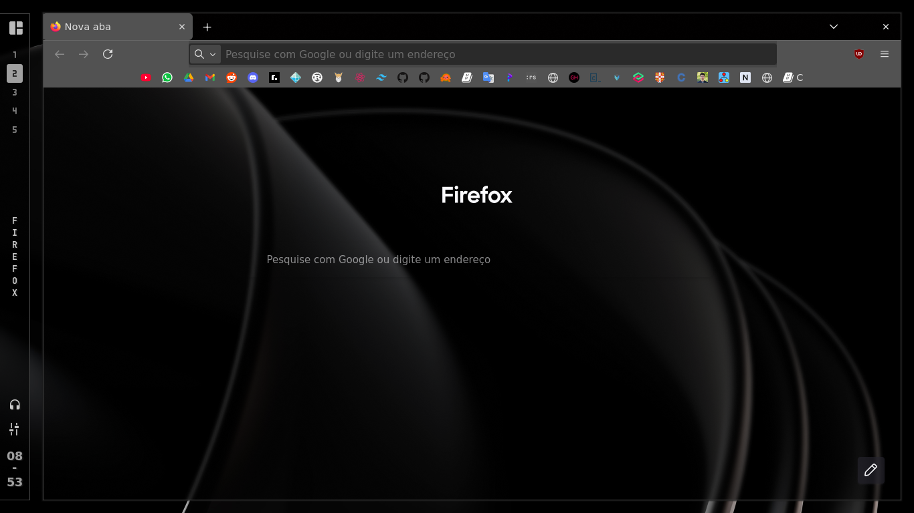

# Dotfiles
Minha configuração do Void Linux.

<p float="left">
  
  
</p>


<p float="left">
  
  
</p>

**Pacotes necessários:**

```bash
hyprland hyprpaper xdg-desktop-portal-hyprland eww rofi socat playerctl pipewire 
```
